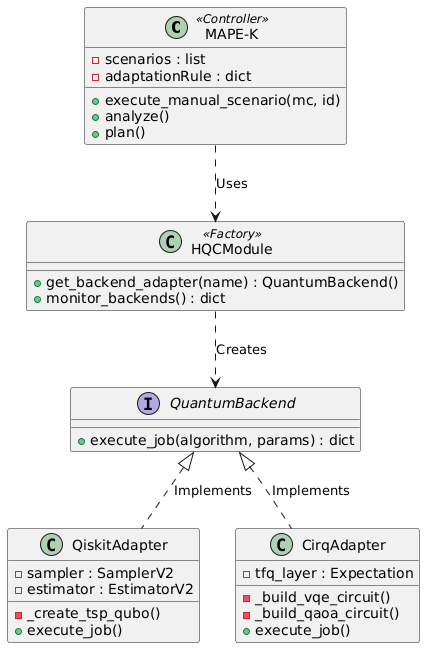

<div align="center">
  <h1><em>QuASAr</em></h1>

  <p>
    <strong>
      A proof-of-concept implementation for bounded runtime self-adaptation
      in hybrid quantum-classical software systems
    </strong>
  </p>

  <p>
    <a href="https://www.python.org/"></a>
    <a href="https://flask.palletsprojects.com/"></a>
    <a href="https://react.dev/"></a>
    <a href="https://www.docker.com/"></a>
    <a href="https://ai.google.dev/gemini-api"></a>
    <a href="https://www.ibm.com/quantum/qiskit"></a>
    <a href="https://quantumai.google/cirq"></a>
  </p>

  <p>
    <a href="#overview">Overview</a> ·
    <a href="#running-scenario">Running Scenario</a> ·
    <a href="#prototype-architecture">Architecture</a> ·
    <a href="#adaptation-workflow">Adaptation Workflow</a> ·
    <a href="#getting-started">Getting Started</a> ·
    <a href="#scope-and-limitations">Limitations</a>
  </p>
</div>

> [!NOTE]
> This repository is based on **FMweb-K-Quantum**, originally developed by Sebastián Candia as part of his undergraduate thesis. The prototype was adapted and extended to support the QuASAr proof-of-concept implementation.

---

## Overview

**QuASAr** (*Quantum Adaptive Software Architecture*) is a **Dynamic Software Product Line (DSPL)** architecture for model-governed runtime self-adaptation in **Hybrid Quantum-Classical Software Systems** (HSS). This repository provides a proof-of-concept implementation of its bounded runtime adaptation mechanisms.

The prototype connects runtime observations with explicit adaptation decisions through a **MAPE-K feedback loop**. An LLM supports contextual reasoning by proposing *candidate adaptations*, while **deterministic guardrails** validate their conformance with the implemented variability, compatibility, policy, and parameter constraints before enactment.

> [!IMPORTANT]
> This artifact is a partial research prototype intended to assess architectural feasibility. It should not be interpreted as an industrial runtime platform.

## Running Scenario

The prototype represents an HSS in which classical services coordinate an optimization workflow with an optional hybrid quantum-classical capability. The application functionality, optimization goal, and workflow structure remain fixed, while runtime adaptation is restricted to three explicitly controllable decisions:

- **C1 — Backend rebinding:** infrastructure degradation may trigger the selection of another admissible execution backend (**D1**).
- **C2 — Shot adjustment:** simulated noise or execution-quality degradation may trigger a bounded change in the number of shots (**D4**).
- **C3 — HQC activation or bypass:** application context and domain policies may determine whether the HQC capability remains enabled or is bypassed (**D6**).

Together, these cases exercise infrastructure-, parameter-, and capability-level adaptation without synthesizing a new workflow at runtime.

## HQC Execution Abstraction

The prototype encapsulates SDK-specific quantum execution behind a common abstraction, preventing the MAPE-K controller from depending directly on Qiskit or Cirq. Instead, the controller delegates backend resolution to `HQCModule`, which implements the **Factory Method** pattern.



*Figure 1. Class diagram of the HQC execution abstraction implemented by the prototype.*

`HQCModule` monitors the available backends and creates an implementation of the `QuantumBackend` interface according to the selected configuration. This interface defines a common execution contract through `execute_job()`, while `QiskitAdapter` and `CirqAdapter` encapsulate the operations required by their respective SDKs.

This design separates adaptation control from SDK-specific implementation details. Consequently, an accepted backend-selection decision can redirect execution by changing the selected adapter without modifying the MAPE-K controller or the application logic.

> [!NOTE]
> The current adapters encapsulate different optimization workloads: `QiskitAdapter` implements a TSP-oriented QAOA workload, whereas `CirqAdapter` implements a Max-Cut-oriented VQE workload. Backend rebinding therefore demonstrates software-level execution redirection, not semantic-preserving migration of an identical workload between SDKs.

## Adaptation Workflow

Each adaptation cycle follows the same bounded workflow:

1. **Monitor** collects the relevant runtime observations.
2. **Analyze** determines whether adaptation is required and identifies the affected runtime decision.
3. **Plan** constructs a bounded decision context, from which Gemini proposes a candidate adaptation and rationale.
4. **Validate** checks the candidate against the implemented variability, compatibility, policy, and parameter constraints.
5. **Execute** enacts only an accepted configuration through the managed HSS or HQC execution layer.
6. **Knowledge** retains the current configuration, observations, candidate, validation outcome, execution evidence, and resulting state.

> [!NOTE]
> The LLM has no enactment authority. It proposes a bounded candidate, while deterministic guardrails control whether that candidate may reach execution.

Each cycle records the following adaptation provenance:

> **Observation → Affected Decision → Candidate → Validation → Enactment or Rejection**

## Getting Started

### Prerequisites

Docker Compose is the recommended setup because it installs the Python, Node.js, and Graphviz dependencies inside the service images.

- Docker with the Compose plugin
- A Google API key with access to `models/gemini-2.5-flash`

For a manual setup:

- `uv`; Python 3.10 is pinned and installed when required
- Node.js `^20.19.0` or `>=22.12.0`, with npm
- [Graphviz](https://graphviz.org/) with `dot` available on `PATH`
- A Linux x86_64 environment for the required TensorFlow Quantum wheel
- Optionally, a running Docker daemon for container inspection and reconfiguration

### Docker Compose

From the repository root, create the backend environment file:

```bash
cp Backend/.env.example Backend/.env
```

Set a valid Google API key in `Backend/.env`:

```dotenv
GOOGLE_API_KEY=your_api_key
```

Build and start the frontend and backend:

```bash
docker compose up --build
```

Open the dashboard at `http://localhost:5173`. The backend API is available at `http://localhost:8000`. Stop both services with:

```bash
docker compose down
```

> [!WARNING]
> The Compose configuration mounts `/var/run/docker.sock` so that the executor can inspect, start, and stop matching containers. This grants the backend control over the host Docker daemon; run only trusted backend code with this configuration.

### Manual Setup

Start the backend:

```bash
cd Backend
uv sync --locked
cp .env.example .env
uv run --locked python run.py
```

In a second terminal, start the frontend:

```bash
cd Frontend
npm ci
npm run dev
```

The backend binds to `0.0.0.0:8000`; the frontend connects to `http://127.0.0.1:8000` and is served locally at `http://localhost:5173`.

## Running the Prototype

The dashboard allows a user to select an operating scenario and inspect the monitored context, candidate rationale, validated configuration, configuration graph, execution evidence, logs, and MAPE-K trace.

A cycle can also be initiated through the backend API:

```bash
curl http://127.0.0.1:8000/api/scenarios

curl -X POST http://127.0.0.1:8000/api/select-scenario \
  -H 'Content-Type: application/json' \
  -d '{"scenario_id": 1}'

curl http://127.0.0.1:8000/api/state
```

The adaptation runs asynchronously. Wait until `is_running` is `false` before interpreting the final configuration and trace. Only one adaptation thread may run at a time; a concurrent request returns HTTP `423`.

Generated logs, configuration graphs, and quantum-execution evidence are written under `Backend/data/`.

### Verification

The repository provides backend architecture checks and frontend static verification:

```bash
cd Backend
uv run --locked python verify_backend.py

cd ../Frontend
npm run lint
npm run build
```

`verify_backend.py` checks imports, application initialization, MAPE-K phase construction, and required route registration. It does not execute a complete Gemini or quantum adaptation cycle.

## Reproducing the Adaptation Cases

The three QuASAr cases can be exercised by selecting or injecting the corresponding runtime conditions:

- **C1:** introduce excessive backend latency, unavailability, or an unsuitable backend status. The trace should identify **D1**, validate an alternative backend, and rebind the corresponding adapter when the candidate is admissible.
- **C2:** introduce simulated noise or execution-quality degradation. The trace should identify **D4**, validate the proposed shot value against its configured bounds, and apply the accepted parameter.
- **C3:** provide an application or problem context in which the domain policy changes the applicability of the HQC capability. The trace should identify **D6** and preserve, enable, or bypass HQC execution according to the validated candidate.

The original operational scenarios and the C1–C3 cases represent different views of the prototype. C1–C3 organize the adaptation mechanisms and should not be treated as a one-to-one renaming of every original scenario or execution.

## Scope and Limitations

- The prototype evaluates bounded software-level adaptation in a controlled simulation environment; it does not execute on physical QPUs.
- Runtime latency, noise, and execution-quality conditions are injected or simulated.
- Only the runtime-controllable subset exercised by C1–C3 is implemented. Deployment-time decisions are not evaluated independently.
- Runtime governance assets and Knowledge are partially realized and distributed across configuration, policy, state, and logging structures.
- The implemented guardrails cover only the variability, compatibility, policy, and parameter constraints required by the three cases.
- The Qiskit and Cirq adapters encapsulate different optimization workloads: a TSP-oriented QAOA realization and a Max-Cut-oriented VQE realization, respectively. C1 therefore demonstrates adapter rebinding and execution redirection, not semantic-preserving migration of an identical workload.
- Runtime observations are sampled and candidate adaptations depend on an external Gemini model; repeated executions may produce different results.
- Docker reconfiguration affects only pre-existing containers whose names match the selected feature keys; the repository does not provision those managed services.
